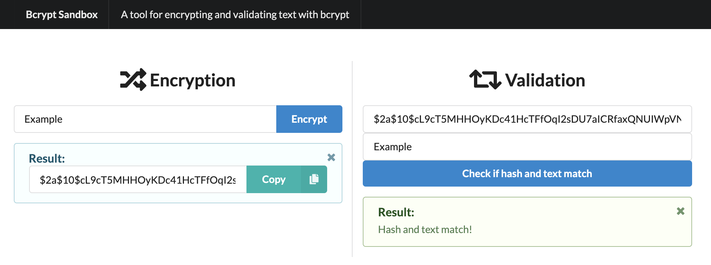

# Bcrypt Sandbox

A tool for encrypting and validating text with bcrypt. ([Live Demo](https://felladrin.github.io/bcrypt-sandbox/index.html))

## Running and Building

After cloning this repository, you can use the following commands:

| Command         | Action                            |
| --------------- | --------------------------------- |
| `npm run dev`   | Start the app in development mode |
| `npm run build` | Build the web app for production  |
| `npm run serve` | Start a production web server     |
